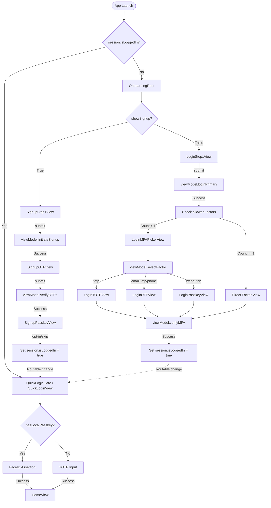

# LoanOS Borrower App Architecture

This document provides a comprehensive technical overview of the LoanOS Borrower application, detailing its architecture, file structure, and core features. It is designed to help new developers understand the system's design and current status.

## 🚀 Tech Stack
- **Language**: Swift 6 (Strict Concurrency enabled)
- **UI Framework**: SwiftUI
- **Communication Protocol**: gRPC (using `GRPCCore` and `grpc-swift` 2.0)
- **State Management**: ObservableObjects (MVVM) and EnvironmentObjects (Session Management)
- **Persistence**: Keychain (for secure tokens) and UserDefaults (for non-sensitive user data)

---

## 🏗 Architecture Pattern
The application follows a modular **MVC-inspired** architecture combined with **MVVM** and **Coordinator** patterns for navigation.

### 1. Root Coordination (`App/`)
The entry point of the app is `LoanOSApp.swift`. It utilizes a `SessionStore` (EnvironmentObject) to decide whether to show the authenticated flow (Home) or the unauthenticated flow (Login/Signup).

### 2. Navigation & Routing (`Controllers/`)
Navigation logic is decoupled from Views using **FlowControllers**. These components manage a `NavigationPath` and define routes for specific features (e.g., `SignupRoute`).
- **`SignupFlowController.swift`**: Orchestrates the multi-step signup sequence (Phone -> Email -> Passkey).
- **`LoginFlowController.swift`**: Manages the login journey, including MFA factor selection and routing.

### 3. Business Logic (`Auth/`, `Services/`)
- **ViewModels**: Manage UI state and interact with repositories. They are designed to be agnostic of the underlying communication protocol.
- **Repositories**: `AuthRepository` acts as the single source of truth for authentication data. It abstracts gRPC calls and handles token injection.
- **Services**: Domain-specific singleton managers for reusable logic:
    - `PasskeyManager`: Handles WebAuthn registration and assertion.
    - `BiometricAuth`: Wraps LocalAuthentication for Face ID/Touch ID.
    - `SessionManager`: Coordinates token lifecycle and silent refreshes.

### 4. Data Layer (`Networking/`, `Models/`)
- **Networking**: Contains gRPC client infrastructure (`AuthGRPCClient`), call option factories, and environment configurations.
- **Models**: Simple data structures and the `SessionStore` for app-wide state.

---

## 📂 Directory Structure

```text
lms_borrower/
├── App/
│   └── LoanOSApp.swift
├── Controllers/
│   ├── LoginFlowController.swift
│   ├── QuickLoginController.swift
│   └── SignupFlowController.swift
├── Auth/
│   ├── AuthRepository.swift
│   ├── LoginViewModel.swift
│   ├── PasskeySetupViewModel.swift
│   ├── SessionManager.swift
│   ├── SetupTOTPViewModel.swift
│   └── SignupViewModel.swift
├── Views/
│   ├── Home/
│   │   ├── HomeView.swift
│   │   ├── SetupPasskeyView.swift
│   │   └── SetupTOTPView.swift
│   ├── Login/
│   │   ├── LoginMFAPickerView.swift
│   │   ├── LoginOTPView.swift
│   │   ├── LoginPasskeyView.swift
│   │   ├── LoginStep1View.swift
│   │   └── LoginTOTPView.swift
│   ├── QuickLogin/
│   │   └── QuickLoginView.swift
│   └── Signup/
│       ├── SignupEmailOTPView.swift
│       ├── SignupOTPView.swift
│       ├── SignupPasskeyView.swift
│       ├── SignupStep1View.swift
│       └── SignupTOTPView.swift
├── Onboarding/
│   ├── AddressProofView.swift
│   ├── BorrowerPersonalDetailsView.swift
│   ├── CompleteProfileView.swift
│   ├── ContentView.swift
│   ├── ESignatureView.swift
│   ├── IncomeDetailsView.swift
│   ├── KYCSubmissionSummaryView.swift
│   ├── KYCVerificationFailedView.swift
│   ├── KYCVerificationSuccessView.swift
│   ├── KYCVerifyingView.swift
│   ├── ReviewDocumentView.swift
│   ├── SignInView.swift
│   ├── SignUpView.swift
│   ├── Theme.swift
│   ├── VerifyIdentityView.swift
│   └── lmsuiApp.swift
├── Networking/
│   ├── AppEnvironment.swift
│   ├── AuthCallOptionsFactory.swift
│   ├── AuthGRPCClient.swift
│   └── GRPCChannelFactory.swift
├── Security/
│   ├── DeviceIDStore.swift
│   ├── JWTClaimsDecoder.swift
│   ├── KeychainHelper.swift
│   ├── PasskeyStatusStore.swift
│   └── TokenStore.swift
├── Services/
│   ├── BiometricAuth.swift
│   ├── PasskeyManager.swift
│   └── QRGenerator.swift
├── Shared/
│   └── SharedComponents.swift
├── Models/
│   └── SessionStore.swift
└── Utils/
    ├── Extensions.swift
    ├── FoundationExtensions.swift
    └── TOTPProvider.swift
```

### File Descriptions

#### `App/`
- **`LoanOSApp.swift`**: The entry point of the app, checking the environment object `SessionStore` to root the application into QuickLoginGate or the Authentication flows.

#### `Controllers/`
- **`LoginFlowController.swift`**: Defines `LoginRoot`, using a NavigationStack to route state transitions between email/password, MFA picker, and distinct OTP views.
- **`QuickLoginController.swift`**: Defines `QuickLoginGate` which renders `QuickLoginView` and conditionally pushes `HomeView` upon local authentication.
- **`SignupFlowController.swift`**: Defines `SignupRoot`, routing registration steps down to Passkey creation and Home.

#### `Auth/`
- **`AuthRepository.swift`**: Central abstraction mapping domain API intents directly into backend gRPC calls.
- **`LoginViewModel.swift`**: A state machine for multi-step login logic, fetching allowed factors and verifying selected credentials securely.
- **`PasskeySetupViewModel.swift`**: Controller handling the Face ID WebAuthn registration process.
- **`SessionManager.swift`**: Handles the lifecycle of JWT tokens including automated background refresh logic loops.
- **`SetupTOTPViewModel.swift`**: Manages the multi-step QR generation and code verification for authenticator enrollment.
- **`SignupViewModel.swift`**: Orchestrates registration parameters, holding internal state untilOTP verification is complete.

#### `Views/`
- **`HomeView.swift`**: Main post-login dashboard, fetching capabilities via `PasskeyStatusStore` to reflect current setup.
- **`SetupPasskeyView.swift` & `SetupTOTPView.swift`**: Modals enabling additional MFA layers for the user account.
- **`LoginStep1View.swift` & `LoginMFAPickerView.swift`**: Views prompting initial credentials and iterating over server-provided multi-factor options.
- **`LoginPasskeyView.swift`, `LoginOTPView.swift`, `LoginTOTPView.swift`**: Granular UI variants handling specific MFA input challenges.
- **`QuickLoginView.swift`**: Accelerated entry interface prompting Face ID or TOTP re-entry for users with valid keychain tokens.
- **`SignupStep1View.swift` & `SignupOTPView.swift`**: Registration form layouts capturing name, phone, password, and verifying identical ownership endpoints.

#### `Onboarding/` (Borrower Profile Form Module)
- **`CompleteProfileView.swift`**: Entry screen for the Borrower KYC initialization UI workflow.
- **`BorrowerPersonalDetailsView.swift`, `AddressProofView.swift`, `IncomeDetailsView.swift`**: Stepwise data capture forms processing borrower details.
- **`ReviewDocumentView.swift` & `ESignatureView.swift`**: Abstract visualizations handling final term agreements.
- **`lmsuiApp.swift`, `ContentView.swift`, `Theme.swift`**: Boilerplate infrastructure executing the onboarding screens as an independent visual prototype.

#### `Networking/`
- **`AppEnvironment.swift`**: Encapsulates base API URI configurations.
- **`AuthGRPCClient.swift`**: The generated Swift gRPC implementation wrapper linking API requests directly to HTTP structures.
- **`GRPCChannelFactory.swift`**: Builds the TLS/Secure HTTP2 channel connecting the client to the server endpoint.
- **`AuthCallOptionsFactory.swift`**: Core Interceptor responsible for directly injecting Bearer Access Tokens into RPC headers.

#### `Security/` & `Models/`
- **`KeychainHelper.swift` / `TokenStore.swift`**: Wrappers performing AES-encrypted read/writes to the iOS Secure Enclave keychain.
- **`DeviceIDStore.swift`**: Persists a UUID locking sessions to physical hardware properties.
- **`JWTClaimsDecoder.swift`**: Parses the token JSON to extract the logical `userID` locally.
- **`PasskeyStatusStore.swift`**: Tracks and caches whether WebAuthn has successfully run a credential save event on this device.
- **`SessionStore.swift` (`Models/`)**: The macro EnvironmentObject broadcasting `isLoggedIn` flags directly informing `LoanOSApp` layout.

#### `Services/` & `Utils/`
- **`PasskeyManager.swift`**: Bridge to `AuthenticationServices`, popping system Face ID sheets for assertions and registrations.
- **`BiometricAuth.swift`**: Trivially checks if Face ID is available on-device.
- **`QRGenerator.swift`**: Formats literal string data (like `otpauth://`) into scannable UIImages.
- **`TOTPProvider.swift`, `Extensions.swift`**: Basic utility extensions to natively shape data interactions.

---

## 🔑 Detailed Application Workflow & Logic

The application follows strict condition-based routing to ensure secure and seamless user experience. Below is the granular logical breakdown for every screen and transition.

### 1. App Launch (`App/LoanOSApp.swift`)
**Condition**: The `SessionStore` checks `TokenStore` for existing Keychain tokens upon initialization.
- If `session.isLoggedIn == true`: Navigates to `QuickLoginGate()`.
    - **Background Task**: Invokes `SessionManager.shared.attemptSilentRestore()`. If the tokens are invalid/revoked, it triggers `session.logout()`, immediately routing the user out.
- If `session.isLoggedIn == false`: Navigates to `OnboardingRoot()`.

### 2. Returning User Flow (`QuickLoginGate` -> `QuickLoginView`)
**Condition**: The user has valid tokens but needs to verify identity to access `HomeView`.
- **Passkey Path**: If `hasLocalPasskey` is true (cached state from previous login), face ID prompt is natively presented.
- **Fallback Path**: If passkey fails or isn't set up, the user enters their TOTP manually.
- **Success**: The boolean `goHome` becomes `true`, pushing `HomeView` into the `NavigationStack`.

### 3. Unauthenticated Entry (`OnboardingRoot`)
A simple routing switch controlled by the `@State private var showSignup`.
- Default is `true`, presenting `SignupRoot`.
- Provides callbacks (`onBackToLogin` and `onGoToSignup`) to swap the view without building a large navigation stack loop.

### 4. Signup Stack (`Controllers/SignupFlowController.swift`)
Managed via `NavigationPath` bound to `SignupRoute`.
1. **`SignupStep1View`**: User submits `email`, `phone`, `password`.
    - **Logic**: Calls `viewModel.initiateSignup`.
    - **Success**: Pushes `SignupRoute.phoneOTP` (`SignupOTPView`).
2. **`SignupOTPView` / `SignupEmailOTPView`**:
    - **Logic**: Collects OTP arrays. `viewModel.verifyOTPs` checks both codes against the registration ID.
    - **Success**: Pushes `SignupRoute.passkey` (`SignupPasskeyView`).
3. **`SignupPasskeyView`**: Option to enable Face ID.
    - **Logic**: Calls `viewModel.registerPasskey()`.
    - **Success or Skip**: Both paths push `.home`. This mutates `session.isLoggedIn = true` dynamically at the root level, collapsing the entire onboarding stack and triggering the `QuickLoginGate`.

### 5. Login Stack (`Controllers/LoginFlowController.swift`)
Navigated strictly by server responses determining the Required MFA factors.
1. **`LoginStep1View`**: Submits `identifier` (Email/Phone) and `password`.
    - **Logic**: `viewModel.loginPrimary()` parses server response for `allowedFactors`.
    - **Condition**: If multiple factors exist, pushes `LoginRoute.mfaSelection` (`LoginMFAPickerView`). If only one factor, pushes that specific view directly.
2. **`LoginMFAPickerView`**:
    - **Logic**: Displays dynamic list of allowed authentication options (TOTP, Authenticator App, Email OTP, SMS). User taps a row.
    - **Condition**: Calls `viewModel.selectFactor()`. Depending on the target, pushes `otp`, `passkey`, or `totp` routes.
3. **Factor Verification Views**:
    - `LoginPasskeyView`: Prompts biometric assertion.
    - `LoginTOTPView` / `LoginOTPView`: Standard numeric keypad collection.
    - **Success**: `viewModel.verifyMFA()` succeeds, tokens are saved to Keychain, `session.isLoggedIn` is toggled true. The UI root transitions to authenticated state.

### 6. Post-Login (`Views/Home/HomeView.swift`)
- **State Check**: `refreshPasskeyStatus()` queries `PasskeyStatusStore` with the decoded `userID` from the JWT.
- **Conditional UI**: If `hasLocalPasskey` is false, it prompts "Set up Passkey". If true, it displays "Manage Passkey".
- **Sheets**: Booleans `showSetupTOTP` and `showSetupPasskey` control modal presentation of their respective views.

### 7. Borrower KYC/Onboarding Flow (`Onboarding/`)
*(Note: Currently built as an independent, isolated workflow module that maps the data collection sequence before backend integration)*
1. **`CompleteProfileView`**: Informational banner. Tapping "Continue" pushes details form.
2. **`BorrowerPersonalDetailsView`**: Collects basic details.
3. **`AddressProofView` / `IncomeDetailsView`**: Sequential data collection bounds.
4. **`ReviewDocumentView` & `ESignatureView`**: End-of-pipe legal verification.

---

## 🔀 Application Logic Flowchart



---

## 🛠 Networking: gRPC
The app uses **gRPC** for all backend communication.
- **Generated Code**: Protobuf definitions are generated into `Networking/Generated/` (not tracked in Git to avoid bloat).
- **Authentication**: `AuthCallOptionsFactory` automatically injects Bearer tokens into request metadata for authenticated RPCs.
- **Concurrency**: Fully utilizes Swift `async/await` for non-blocking network calls.

---

## 🛡 Security
- **Secure Storage**: Tokens (Access/Refresh) are stored in the **iOS Keychain**.
- **Token Lifecycle**: `SessionManager` handles automated token refresh using gRPC `RefreshToken` calls when the access token expires.
- **Device Binding**: A unique `DeviceID` is generated and stored to bind sessions to the physical device.

---

## 🎨 Design System (`Shared/`)
Located in `SharedComponents.swift` and `Theme.swift` (in Onboarding). It defines the app's visual language:
- **Primary Color**: `DS.primary` (typically a curated blue/brand color).
- **Typography**: Custom fonts applied via SwiftUI extensions.
- **Layout**: Reusable card views, buttons, and input fields.
